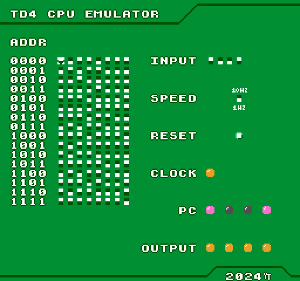
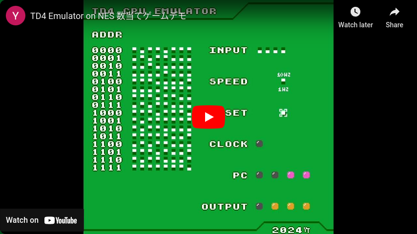

# TD4 Emulator on NES
「[CPUの創りかた][CPU_book_link]」でおなじみのTD4 CPUのエミュレータをNES上で実装しました。



実際の動作画面はこちら↓

<a href="https://youtu.be/9JuJCsVXAZA?si=PUqnEEk0uaylG45c" target="_blank"></a>


## 事前に必要なもの
- [cc65][cc65_getting_started_link]のインストール
- 生成した.nesファイルを実行するためのNESエミュレータ

## .nesファイルの準備

本リポジトリをクローンします。

```bash
git clone https://github.com/yugodenki/td4-emulator-on-nes.git
```

cc65を用いてアセンブルを行います。

```bash
ca65 td4emu.asm -o td4emu.o
```

続けてリンカを実行します。

```bash
ld65 -C memory.cfg -o td4emu.nes td4emu.o
```

上記の処理が終了すれば`td4emu.nes`ファイルが生成されるので、お好みのNESエミュレータで実行してください。


## 使用方法

### 入力

- 画面左側はTD4のROMです。8-bit x 16個のDIPスイッチを模しています。
矢印ボタンでカーソルを移動し、Aボタンでスイッチを切り替えます。
- 「INPUT」はTD4の4-bitの入力です。
- 「SPEED」はTD4の実行速度を調整できます。1Hzあるいは10Hzを選択できます。
- 「RESET」はリセットボタンです。Aボタンを押した瞬間にTD4がリセットされます。

### 表示と出力

- 「CLOCK」はTD4のクロックを表示しています。
- 「PC」はTD4のプログラムカウンタです。プログラムカウンタに表示されているアドレスの命令が実行されています。
- 「OUTPUT」はTD4の4-bitの出力です。


## 実行可能な命令について

下記の命令が実行可能です。

```assembly
ADD A, Im  ; 0000xxxx  AレジスタにImの内容を加算、オーバーフローした場合はキャリーフラグをセット
ADD B, Im  ; 0101xxxx  BレジスタにImの内容を加算、オーバーフローした場合はキャリーフラグをセット
MOV A, Im  ; 0011xxxx  AレジスタにImの内容を転送
MOV B, Im  ; 0111xxxx  BレジスタにImの内容を転送
MOV A, B   ; 00010000  Bレジスタの内容をAレジスタに転送
MOV B, A   ; 01000000  Aレジスタの内容をBレジスタに転送
JMP Im     ; 1111xxxx  Imのアドレスにジャンプ
JNC Im     ; 1110xxxx  キャリーフラグが無ければImのアドレスにジャンプ
IN  A      ; 00100000  INPUTのデータをAレジスタに転送
IN  B      ; 01100000  INPUTのデータをBレジスタに転送
OUT B      ; 10010000  Bレジスタの内容をOUTPUTに表示
OUT Im     ; 1011xxxx  Imの内容をOUTPUTに表示

; ※下位4-bitのxxxxはImデータを表しています。
```

### 下位4-bitに`0000`を指定する前提となっている命令について
TD4 CPUの実機では、基本的にどの命令においてもデータの転送が4-bit全加算器(74HC283)を通して行われ、かつImデータも参照されています。つまり、下位4-bitに`0000`を指定する前提となっている下記の５つの命令については：

```assembly
MOV A, B   ; 00010000  Bレジスタの内容をAレジスタに転送
MOV B, A   ; 01000000  Aレジスタの内容をBレジスタに転送
IN  A      ; 00100000  INPUTのデータをAレジスタに転送
IN  B      ; 01100000  INPUTのデータをBレジスタに転送
OUT B      ; 10010000  Bレジスタの内容をOUTPUTに表示
```

以下のように解釈することも可能です：

```assembly
MOV A, B + Im   ; 0001xxxx  Bレジスタ + Imの内容をAレジスタに転送
MOV B, A + Im   ; 0100xxxx  Aレジスタ + Imの内容をBレジスタに転送
IN + Im  A      ; 0010xxxx  INPUT + Imの内容をAレジスタに転送
IN + Im  B      ; 0110xxxx  INPUT + Imの内容をBレジスタに転送
OUT B + Im      ; 1001xxxx  Bレジスタ + Imの内容をOUTPUTに表示

; ※さらに、全加算器を通るため、これらの５命令もキャリーフラグに影響を与えます。
```

本エミュレータではこの仕様も再現しているため、転送命令と加算命令を１命令に短縮するなどして、16バイトのROMを最大限に活かすことができます。


## 参考
[CPUの創りかた][CPU_book_link]

[CPU_book_link]: https://www.amazon.co.jp/CPU%E3%81%AE%E5%89%B5%E3%82%8A%E3%81%8B%E3%81%9F-%E6%B8%A1%E6%B3%A2-%E9%83%81/dp/4839909865
[cc65_getting_started_link]: https://cc65.github.io/getting-started.html